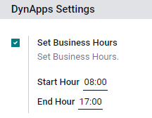
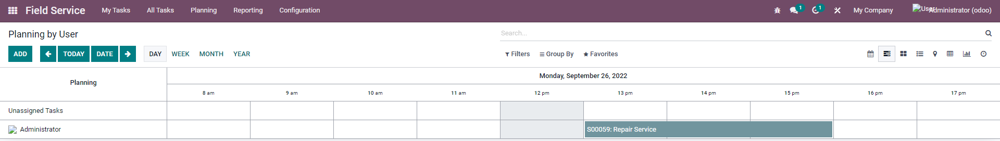
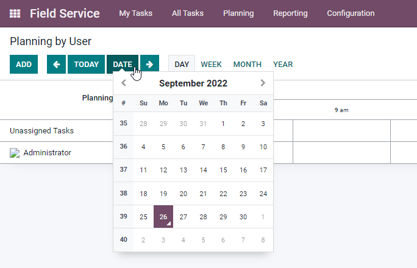

=====
Field Service Gantt View
=====

.. !!!!!!!!!!!!!!!!!!!!!!!!!!!!!!!!!!!!!!!!!!!!!!!!!!
   !! This module has been created by Dynapps n.v. !!
   !!!!!!!!!!!!!!!!!!!!!!!!!!!!!!!!!!!!!!!!!!!!!!!!!!

.. contents::
   :local:

General Information
====

This module makes it possible to configure business hours and show them in the GANTT view by day.

+---------------------------------------------------+
| .. image:: static/description/dyn_rtl_fs_gantt.png|
+---------------------------------------------------+

* Name: Dynapps Retail - Field Service Gantt
* Technical Name: dyn_rtl_fs_gantt

Technical Data
====
Dependencies
~~~~

* project_enterprise
* industry_fsm_report
* industry_fsm
* hr

Usage
====
Configuration Settings
~~~~

In Field Service > Configuration > Settings a new section "Dynapps Settings" has been added.
If Set Business Hours = True, you can define the default working hours of your company

GANTT view
~~~~~

When you open the GANTT view and select the day view you'll only see the time range set in the Business Hours Settings.

Date Selector
~~~~

You can also select a date to navigate faster.

Group By
~~~~

The group by functionality has been extended with Department and Parent Department from the employees.

+-------------------------------------------+
| .. image:: static/description/employee.png|
+-------------------------------------------+

+---------------------------------------------+
| .. image:: static/description/department.png|
+---------------------------------------------+

+--------------------------------------------------------+
| .. image:: static/description/group_by_department_1.png|
+--------------------------------------------------------+

+--------------------------------------------------------+
| .. image:: static/description/group_by_department_2.png|
+--------------------------------------------------------+

Maintainers
====

This module is maintained by Dynapps N.V.

